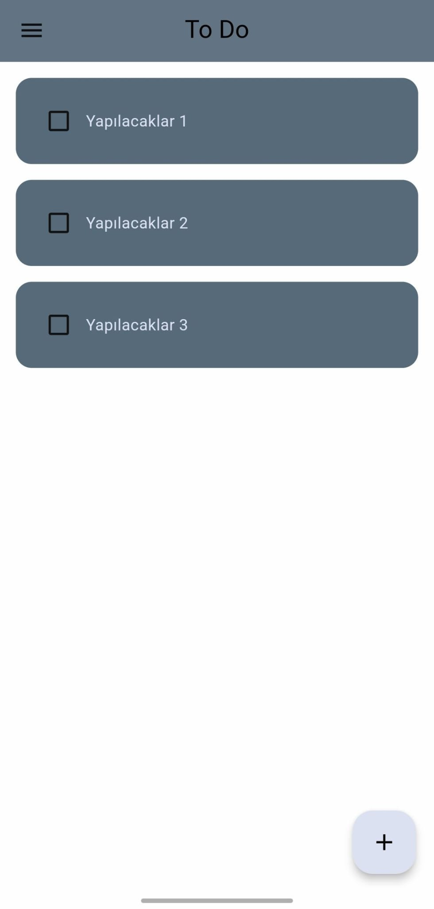
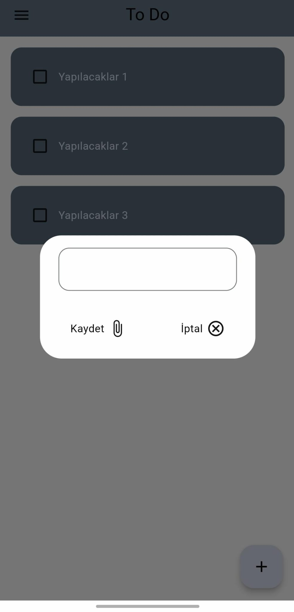
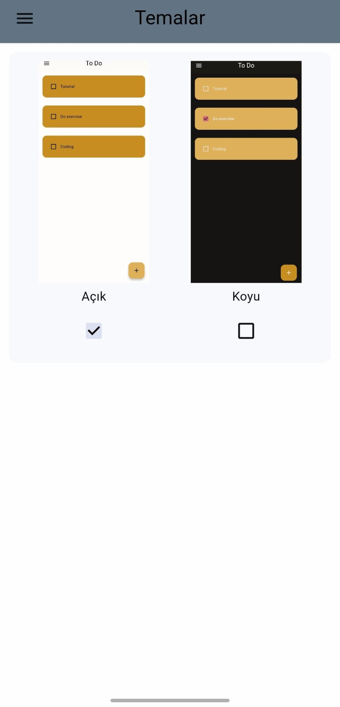
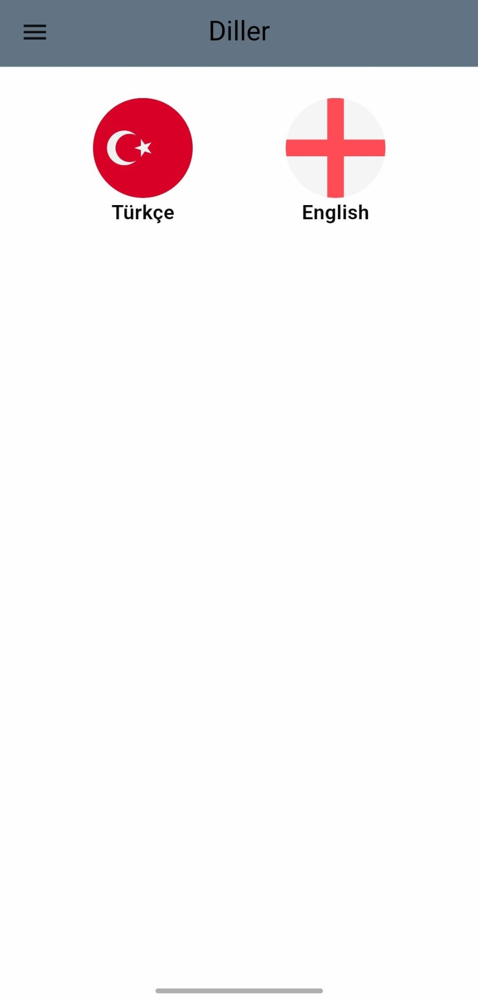

# to_do_app

Basit, hızlı ve öğrenmeye yönelik bir **Flutter yapılacaklar (To-Do) uygulaması**.  
Kayıt ekleme/silme, tamamlandı işaretleme ve temel filtreleme akışlarını örneklemek üzere hazırlanmıştır.

## Özellikler
- ✅ Görev ekleme / düzenleme / silme  
- ✅ Görevleri tamamlandı olarak işaretleme  
- ✅ Temel sıralama/filtreleme (tamamlananlar / aktifler)  
- ✅ Çoklu platform: **Android, iOS, Web, Windows, macOS, Linux**

> Bu listeyi kendi uygulama kapsamına göre güncelleyebilirsin.

## Ekran Görüntüleri

<p float="left">
  
  
  
  
</p>

## Mimari & Paketler
- **Flutter** ile çoklu platform hedefleme  
- Basit katmanlar: `UI` → `State/Model` → (opsiyonel) `Data`  
- (Varsa) durum yönetimi: _Provider / Riverpod / Bloc_  
- (Varsa) yerel depolama: _Hive / SharedPreferences / Sqflite_

> `pubspec.yaml`’a eklediğin paketlere göre bu kısmı netleştir.

## Kurulum
1. **Flutter’ı kur** (3.x önerilir): <https://docs.flutter.dev/get-started/install>  
2. Depoyu klonla:
   ```bash
   git clone https://github.com/Yido1007/to_do_app.git
   cd to_do_app
   ```
3. Bağımlılıkları indir:
   ```bash
   flutter pub get
   ```

### Platform Spesifik Gereksinimler
- **Android**: Android Studio, Android SDK, bir cihaz/emülatör  
- **iOS**: Xcode, iOS Simulator veya gerçek cihaz  
- **Web**: Chrome veya Edge (Flutter web desteği aktif olmalı)

## Çalıştırma
```bash
# Tüm bağlı cihazları listele
flutter devices

# Varsayılan cihaza çalıştır
flutter run

# Belirli platform örnekleri
flutter run -d chrome
flutter run -d android
flutter run -d ios
```

### Build
```bash
# Android (APK / AppBundle)
flutter build apk
flutter build appbundle

# iOS (release)
flutter build ios

# Web (release)
flutter build web
```

## Proje Yapısı
```
to_do_app/
├─ lib/
│  ├─ main.dart
│  ├─ core/          # sabitler, theme, helpers
│  ├─ data/          # repo, local storage, model
│  ├─ features/
│  │  └─ todos/      # ekranlar, widget'lar, state
│  └─ widgets/       # ortak bileşenler
├─ assets/           # fonts, images, screenshots
├─ android/ ios/ web/ macos/ linux/ windows/
├─ pubspec.yaml
└─ README.md
```
> Klasör adlarını mevcut yapına göre uyarlayabilirsin.

## Test
```bash
# Birim testler
flutter test

# Widget/golden testlerini de ekleyebilirsin
```

## Yol Haritası
- [ ] Görevleri kategorilendirme / etiketler  
- [ ] Son tarih & hatırlatıcı  
- [ ] Arama & gelişmiş filtreler  
- [ ] Kalıcı depolama (Hive/Sqflite)  
- [ ] Çok dilli destek (TR/EN)  
- [ ] CI (GitHub Actions) + otomatik format/lint


## Katkı
Katkılar memnuniyetle kabul edilir!  
1. Bir **issue** aç veya **fork**la.  
2. Yeni bir dal oluştur: `feat/kisa-aciklama`  
3. Testleri çalıştır, linter’ı düzelt.  
4. Açıklayıcı bir PR gönder.

